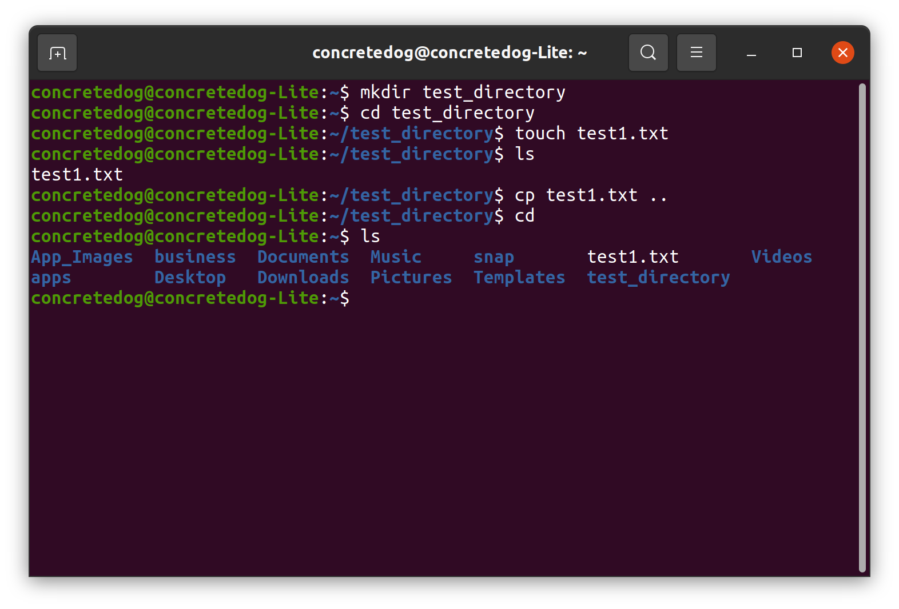

# How to create a file using the Terminal

1. 
 
| Syntax | Description |Example
| ------ | ----------- |----------
| touch fileName | ***Create File By Terminal*** | `touch Server.js`
| mkdir fileName | ***Crete new dectionery By teriminal*** | `mkdir Markdown`

2. 
> commen mistake: many people 
>> * write wrong letters *C* insted write touch they write ~~toush~~ and put S insted of *C*.
>>*   Write Uppercase insted on lower case. make sure write all letters in lower case.

3. 

for more details about Writing in Terminal follow the link:
 [TerminalLesson](https://github.com/microsoft/terminal)

4. 
- [x] complated part 1 of intro-to-markdown-lab
- [x] complated part 2 of intro-to-markdown-lab
- [x] Push new code to github
